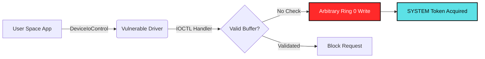

import AnimatedExploitChain from '@site/src/components/AnimatedExploitChain';

This post demonstrates the latest feature additions to the **Haxnation blog platform**. The goal of this update is to make technical posts more interactive without forcing authors to leave Markdown: pages can now combine MDX support, live React components, diagrams, mathematical notation, richer media, and global blog discovery in one workflow.

<!-- truncate -->

## What Was Added

This update adds five capabilities to the publishing experience:

1. **Interactive React components** for stateful demonstrations inside an MDX post.
2. **Native Mermaid diagrams** for visualizing technical workflows.
3. **KaTeX mathematical notation** for readable formulas and security models.
4. **Image zoom and captions** for inspecting research figures without leaving the page.
5. **A global blog search index** that searches across all posts, even though the home page still displays ten posts per page and keeps its Older entries navigation.

The sections below demonstrate each addition with a small security-research example.

## 1. Interactive React Demonstrations

MDX posts can now embed stateful React components directly into the article. The component below demonstrates a kernel exploitation progression. Click **[STEP >]** or **[PAUSE]** to move through the states:

<AnimatedExploitChain />

---

## 2. Mermaid Workflow Diagrams

Authors can now write Mermaid diagrams directly in MDX and keep the source close to the explanation. This example models a user-space request moving through a vulnerable driver:

---

## 3. KaTeX Security Mathematics

Technical posts can now render standard LaTeX math syntax for cryptographic entropy, probability, and finite-field calculations:

The Shannon Entropy $H(X)$ of a byte sequence is calculated as:

$$
H(X) = -\sum_{i=1}^{n} P(x_i) \log_2 P(x_i)
$$

For asymmetric key validation over finite field $\mathbb{F}_p$:

$$
y^2 \equiv x^3 + ax + b \pmod{p}
$$

---

## 4. Research Tables and Inline Code Styling

Tables and inline code are styled as part of the research reading experience. The following protected-process signer hierarchy shows how structured reference material can sit beside the narrative:

| Signer Value | Signer Name | Target Protected Processes |
| :--- | :--- | :--- |
| `0x07` / `0x06` | `WinSystem` / `WinTcb` | `smss.exe`, `csrss.exe`, `services.exe` |
| `0x05` | `Windows` | Core Windows OS binaries (`wininit.exe`) |
| `0x04` | `Lsa` | `lsass.exe` (Credential storage) |
| `0x03` | `Antimalware` | AV/EDR Engines (`MsMpEng.exe`) |
| `0x00` | `None` | Unprotected standard processes |

---

## 5. Click-to-Zoom Figures and Captions

Images now support click-to-zoom, while captions remain readable across light and dark mode:

<figure>
  
  <figcaption className="diagram-caption">
    <strong>Fig 1.1:</strong> Haxnation. Forging Elite Cyber Talent.
  </figcaption>
</figure>
